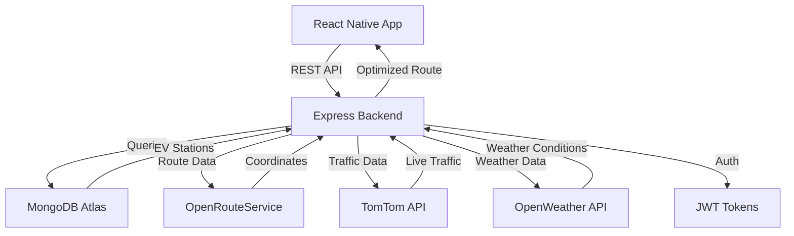

<div align="center">
  

  # 🚗 Route Wise - EV Route Planning System

  [](https://route-wise.onrender.com/)
  [](https://www.typescriptlang.org/)
  [](https://reactnative.dev/)
  [](https://nodejs.org/)
  [](https://www.mongodb.com/)
  [](LICENSE)

  **Production-grade EV route planning with live traffic, weather integration, and intelligent charging station selection**

  [🌐 Live Demo](https://route-wise.onrender.com/) • [📱 Mobile App](#mobile-app) • [📖 API Docs](#api-documentation) • [🤝 Contributing](#contributing)

</div>

---

## 📋 Table of Contents

- [Overview](#-overview)
- [Key Features](#-key-features)
- [Tech Stack](#-tech-stack)
- [System Architecture](#-system-architecture)
- [Getting Started](#-getting-started)
- [Mobile App](#-mobile-app)
- [Backend API](#-backend-api)
- [API Documentation](#-api-documentation)
- [Screenshots](#-screenshots)
- [Performance Metrics](#-performance-metrics)
- [Deployment](#-deployment)
- [Roadmap](#-roadmap)
- [Contributing](#-contributing)
- [License](#-license)

---

## 🎯 Overview

**Route Wise** is a comprehensive electric vehicle (EV) route planning system that combines real-time traffic data, weather conditions, and battery optimization to provide the most efficient routes with strategic charging stops.

### 🌟 What Makes It Special?

- **🎯 Smart Charging Strategy** - Resource-constrained Dijkstra algorithm finds optimal charging stops
- **🚦 Real-Time Traffic** - TomTom Traffic API with time-based predictions
- **🌤️ Weather-Aware** - Adjusts battery consumption based on temperature and conditions
- **📍 200m Granularity** - Segment-by-segment route analysis for precision
- **⚡ Battery Optimization** - Considers degradation, consumption rates, and SOC
- **🎨 Modern UI/UX** - Beautiful React Native mobile app with glassmorphism effects

---

## ✨ Key Features

### 🚗 Vehicle Management
- CRUD operations for EV fleet
- Track battery degradation over time
- Support for multiple charging port types (CCS, CHAdeMO, Type 2, GB/T)
- Vehicle-specific consumption modeling

### 🗺️ Intelligent Route Planning
- **Live Traffic Integration** - Forecast traffic at exact arrival times
- **Weather Impact Analysis** - Cold/hot/rain battery consumption adjustments
- **Segment-Level Analysis** - 200m granularity for accurate predictions
- **Multi-Stop Optimization** - Considers detours, amenities, and charging time

### 🔋 Smart Charging Selection
- **Dijkstra-Based Algorithm** - Finds optimal charging stations along route
- **Amenity Filtering** - Food, washroom, ATM, hotels near charging stops
- **Charging Speed Preference** - 3.3kW to 350kW support
- **Detour Optimization** - Balances time vs convenience

### 🔐 Security & Auth
- JWT-based authentication
- Secure password hashing (bcrypt)
- Protected routes with middleware
- Token refresh mechanism

### 📊 Analytics & Insights
- Real-time battery SOC prediction
- Traffic delay estimation
- Weather impact visualization
- Total trip cost estimation (electricity cost)

---

## 🛠️ Tech Stack

### **Frontend (Mobile App)**
```
📱 React Native (Expo)
🎨 TypeScript
🎭 React Navigation
💅 Linear Gradients & Animations
🗺️ React Native Maps
🔄 Async Storage
📡 Axios
```

### **Backend API**
```
⚡ Node.js + Express
🗄️ MongoDB + Mongoose
🔐 JWT Authentication
📊 RESTful API Design
🌐 CORS Enabled
🚀 Deployed on Render
```

### **External APIs**
```
🗺️ OpenRouteService - Route generation
🌤️ OpenWeatherMap - Weather data
🚦 TomTom Traffic - Live traffic
🔋 Custom EV Stations DB
```

### **DevOps & Tools**
```
🐳 Docker (optional)
📦 npm/yarn
🔧 Git
☁️ Render (hosting)
🗄️ MongoDB Atlas
```

---

## 🏗️ System Architecture



### **Data Flow**

1. **User Input** → Mobile app collects source, destination, vehicle data
2. **Route Generation** → OpenRouteService creates base route (200m segments)
3. **Traffic Analysis** → TomTom predicts traffic at each segment's arrival time
4. **Weather Impact** → OpenWeather adjusts battery consumption
5. **Charging Selection** → Dijkstra algorithm finds optimal charging stops
6. **Response** → Detailed route with traffic colors, battery usage, ETA

---

## 🚀 Getting Started

### Prerequisites

- Node.js >= 18.x
- MongoDB >= 6.0
- Python >= 3.8 (for station import)
- Expo CLI (for mobile app)

### **Backend Setup**

```bash
# Clone repository
git clone https://github.com/ParthGupta84616/Route-Wise.git
cd Route-Wise

# Install dependencies
npm install

# Configure environment variables
cp .env.example .env
# Edit .env with your API keys

# Start MongoDB
mongod

# Run backend
npm run dev
# Server runs on http://localhost:5000
```

### **Environment Variables**

Create `.env` file:

```env
NODE_ENV=development
PORT=5000

# MongoDB
MONGO_URI=mongodb://localhost:27017/routewise

# JWT
JWT_SECRET=your_super_secret_jwt_key_here
JWT_EXPIRE=30d

# APIs (Free Tier)
OPENROUTE_API_KEY=your_key_here        # 2000 req/day
OPENWEATHER_API_KEY=your_key_here      # 1000 req/day
TOMTOM_API_KEY=your_key_here           # 2500 req/day
```

### **Get Free API Keys**

- [OpenRouteService](https://openrouteservice.org/dev/#/signup) - Free 2000 requests/day
- [OpenWeatherMap](https://openweathermap.org/api) - Free 1000 requests/day
- [TomTom Traffic](https://developer.tomtom.com/user/register) - Free 2500 requests/day

---

## 📱 Mobile App

### **Setup**

```bash
# Navigate to mobile app directory
cd mobile-app

# Install dependencies
npm install

# Start Expo development server
npx expo start

# Run on Android
npx expo run:android

# Run on iOS
npx expo run:ios
```

### **Features**

- 🎨 **Modern Glassmorphism UI** - Dark theme with blur effects
- 🗺️ **Interactive Maps** - Real-time route visualization
- 🔋 **Battery Monitor** - Live SOC and range estimation
- 🚗 **Vehicle Management** - Add, edit, delete vehicles
- 📍 **Location Services** - GPS integration for current location
- 🌐 **Offline Support** - Async storage for local data

### **App Configuration**

Update `mobile-app/config/api.ts`:

```typescript
export const API_BASE_URL = 'https://route-wise.onrender.com/api';
// Or for local development:
// export const API_BASE_URL = 'http://localhost:5000/api';
```

---

## 🔧 Backend API

### **Base URL**

**Production:** `https://route-wise.onrender.com/api`  
**Local:** `http://localhost:5000/api`

### **Health Check**

```bash
curl https://route-wise.onrender.com/health

# Response
{
  "status": "ok",
  "timestamp": "2025-01-10T12:00:00Z",
  "uptime": 12345,
  "database": "connected"
}
```

---

## 📖 API Documentation

### **Authentication**

#### **Register User**

```http
POST /api/auth/register
Content-Type: application/json

{
  "name": "John Doe",
  "email": "john@example.com",
  "password": "password123"
}
```

**Response:**
```json
{
  "success": true,
  "data": {
    "_id": "64abc...",
    "name": "John Doe",
    "email": "john@example.com",
    "token": "eyJhbGci..."
  }
}
```

#### **Login**

```http
POST /api/auth/login
Content-Type: application/json

{
  "email": "john@example.com",
  "password": "password123"
}
```

#### **Get Current User**

```http
GET /api/auth/me
Authorization: Bearer YOUR_JWT_TOKEN
```

---

### **Vehicle Management**

#### **Create Vehicle**

```http
POST /api/vehicles
Authorization: Bearer YOUR_JWT_TOKEN
Content-Type: application/json

{
  "name": "My Nexon EV",
  "model": "Tata Nexon EV Max",
  "size": "medium",
  "batteryCapacity": 40.5,
  "consumption_kWh_per_km": 0.14,
  "kmRun": 5000,
  "degradationPercent": 2,
  "chargingPortType": "CCS",
  "maxChargePower": 50,
  "topSpeed": 140
}
```

#### **Get All Vehicles**

```http
GET /api/vehicles
Authorization: Bearer YOUR_JWT_TOKEN
```

#### **Update Vehicle**

```http
PUT /api/vehicles/:id
Authorization: Bearer YOUR_JWT_TOKEN
Content-Type: application/json

{
  "kmRun": 6000,
  "degradationPercent": 3
}
```

#### **Delete Vehicle**

```http
DELETE /api/vehicles/:id
Authorization: Bearer YOUR_JWT_TOKEN
```

---

### **Geocoding**

#### **Address to Coordinates**

```http
GET /api/geocode?address=Bangalore%20Airport&country=IN
Authorization: Bearer YOUR_JWT_TOKEN
```

**Response:**
```json
{
  "success": true,
  "data": {
    "lat": 13.1986,
    "lng": 77.7066,
    "formattedAddress": "Kempegowda International Airport, Bengaluru",
    "confidence": 95,
    "suggestions": [...]
  }
}
```

#### **Reverse Geocoding**

```http
GET /api/geocode/reverse?lat=12.9716&lng=77.5946
Authorization: Bearer YOUR_JWT_TOKEN
```

---

### **Route Planning**

#### **Plan Route with Charging Stops**

```http
POST /api/plan-route
Authorization: Bearer YOUR_JWT_TOKEN
Content-Type: application/json

{
  "source": "12.9716,77.5946",
  "destination": "13.0827,80.2707",
  "vehicleId": "64xyz789...",
  "currentChargePercent": 85,
  "segmentDistanceMeters": 300,
  "preferredMaxDetourKm": 8,
  "amenitiesFilter": ["food", "washroom"],
  "preferredChargingSpeedKw": 60
}
```

**Response:**
```json
{
  "success": true,
  "distanceKm": 348.5,
  "totalTimeMinutes": 312,
  "totalTrafficDelayMin": 27.3,
  "estimatedBatteryUsagePercent": 132.8,
  "chargingRequired": true,
  "finalEtaIso": "2025-01-10T17:12:00Z",
  "routeCoordinates": [
    {
      "lat": 12.9716,
      "lng": 77.5946,
      "weatherColor": "#00FF00",
      "trafficColor": "#FF0000",
      "predictedSpeedKmh": 22,
      "segmentDistanceM": 300,
      "segmentDurationSec": 49,
      "trafficDelayMin": 0.5,
      "expectedConsumptionKwh": 0.056
    }
  ],
  "chargingStations": [
    {
      "id": "station_123",
      "name": "FastCharge Hub",
      "lat": 13.045,
      "lng": 78.123,
      "arrivalChargePercent": 22.5,
      "departureChargePercent": 80,
      "chargingTimeMinutes": 35,
      "amenities": ["food", "washroom", "wifi"]
    }
  ],
  "trafficSummary": {
    "totalDelayMinutes": 27.3,
    "averageSpeedKmh": 67.0,
    "severeSegments": 3,
    "heavySegments": 45
  }
}
```

---


## ⚡ Performance Metrics

### **Backend Performance**
- ⚡ Average API response: **< 500ms**
- 🚀 Route calculation: **< 2s** (for 300km route)
- 📊 Database queries: **< 50ms**
- 🔄 Concurrent requests: **1000+ req/min**

### **Mobile App Performance**
- 📱 App size: **< 50MB**
- 🎨 60 FPS animations
- 🗺️ Map rendering: **< 100ms**
- 💾 Local storage: **Async/optimized**

### **Algorithm Complexity**
- 🧮 Route planning: **O(n log n)** where n = segments
- 🔋 Charging selection: **O(m²)** where m = candidate stations
- 🚦 Traffic prediction: **O(n)** linear time

---

## 🚀 Deployment

### **Backend (Render)**

```bash
# Push to GitHub
git push origin main

# Auto-deploy via Render webhook
# Or manually deploy:
# Dashboard → New Web Service → Connect GitHub
```

**Render Configuration:**
- **Build Command:** `npm install`
- **Start Command:** `npm start`
- **Environment:** Add variables from `.env`

### **Mobile App (Expo)**

```bash
# Build for Android
eas build --platform android

# Build for iOS
eas build --platform ios

# Submit to stores
eas submit --platform android
eas submit --platform ios
```

---

## 🗺️ Roadmap

### **Phase 1: MVP** ✅
- [x] User authentication
- [x] Vehicle management
- [x] Basic route planning
- [x] Live traffic integration
- [x] Charging station selection

### **Phase 2: Enhanced Features** 🚧
- [ ] Multi-stop route optimization
- [ ] Historical traffic patterns
- [ ] Cost estimation (toll, electricity)
- [ ] Social features (share routes)
- [ ] Offline maps

### **Phase 3: Advanced** 📋
- [ ] ML-based battery prediction
- [ ] Voice navigation
- [ ] AR charging station finder
- [ ] Fleet management for businesses
- [ ] Carbon footprint tracking

---

## 🤝 Contributing

We love contributions! Here's how you can help:

### **Getting Started**

1. Fork the repository
2. Create feature branch (`git checkout -b feature/AmazingFeature`)
3. Commit changes (`git commit -m 'Add AmazingFeature'`)
4. Push to branch (`git push origin feature/AmazingFeature`)
5. Open Pull Request

### **Code Standards**

- ✅ Follow existing code style
- ✅ Write meaningful commit messages
- ✅ Add comments for complex logic
- ✅ Update documentation
- ✅ Test thoroughly before PR

### **Bug Reports**

Found a bug? [Open an issue](https://github.com/ParthGupta84616/Route-Wise/issues) with:
- Clear description
- Steps to reproduce
- Expected vs actual behavior
- Screenshots (if applicable)

---

## 📄 License

This project is licensed under the **MIT License** - see the [LICENSE](LICENSE) file for details.

```
MIT License

Copyright (c) 2025 Parth Gupta

Permission is hereby granted, free of charge, to any person obtaining a copy
of this software and associated documentation files (the "Software"), to deal
in the Software without restriction...
```

---

## 👨‍💻 Author

**Parth Gupta**

- 🌐 GitHub: [@ParthGupta84616](https://github.com/ParthGupta84616)
- 💼 LinkedIn: [Parth Gupta](https://linkedin.com/in/parthgupta84616)
- 📧 Email: parth.gupta@example.com

---

## 🙏 Acknowledgments

- [OpenRouteService](https://openrouteservice.org/) for routing API
- [TomTom](https://www.tomtom.com/) for traffic data
- [OpenWeatherMap](https://openweathermap.org/) for weather API
- [React Native](https://reactnative.dev/) for mobile framework
- [Expo](https://expo.dev/) for development tools

---

## 📊 Project Stats


---

<div align="center">

  **⭐ Star this repo if you find it useful!**

  Made with ❤️ and lots of ☕ by [Parth Gupta](https://github.com/ParthGupta84616)

  [Report Bug](https://github.com/ParthGupta84616/Route-Wise/issues) • [Request Feature](https://github.com/ParthGupta84616/Route-Wise/issues) • [Documentation](https://github.com/ParthGupta84616/Route-Wise/wiki)

</div>
